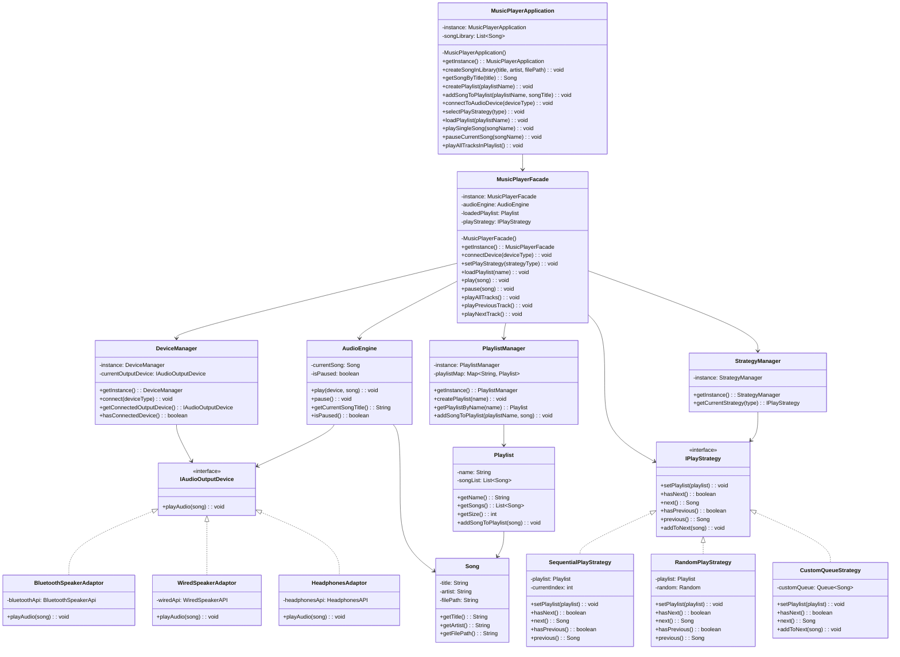
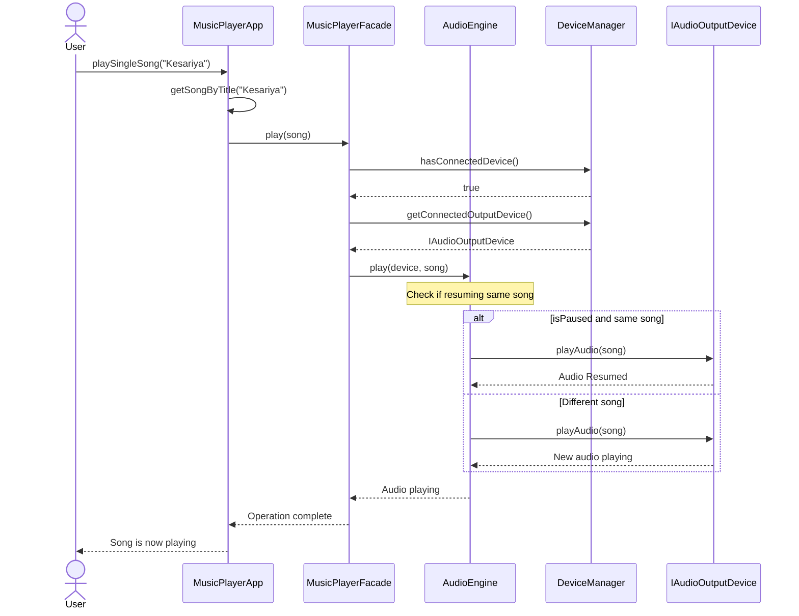
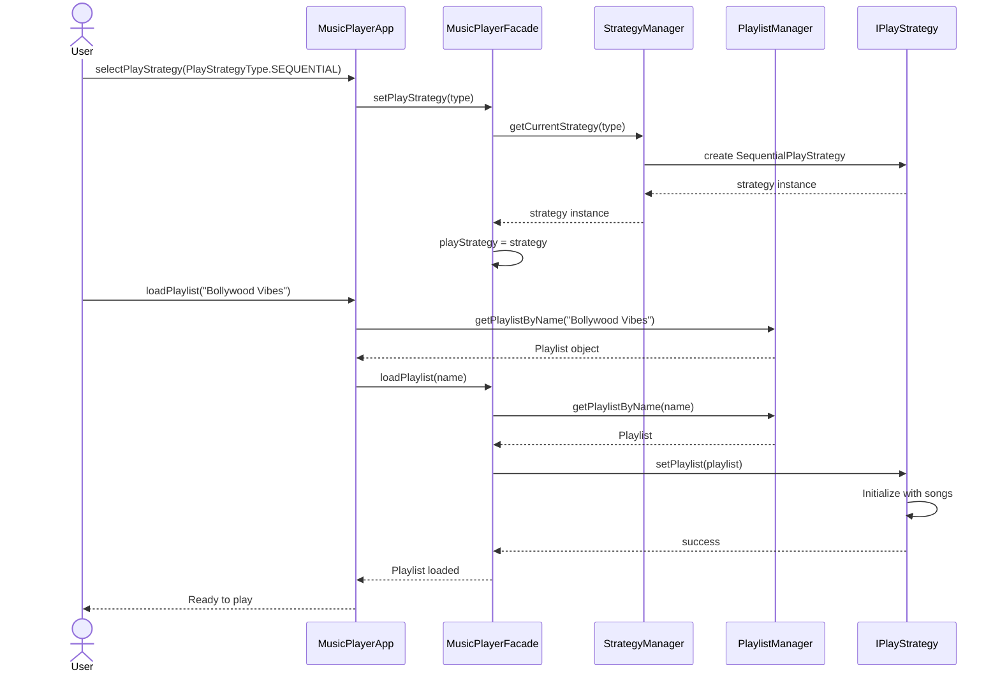

# Music Player System - Low Level Design

## Overview

This is a comprehensive Music Player System implementation demonstrating multiple design patterns including Singleton, Strategy, Adapter, Facade, and Factory patterns. The system supports managing song libraries, creating playlists, and playing music with different strategies (Sequential, Random, Custom Queue) across various audio output devices (Bluetooth, Wired, Headphones).

## Design Patterns Used

### 1. **Singleton Pattern**
Used to ensure only one instance of critical components:
- `MusicPlayerApplication`: Manages the entire application and song library
- `MusicPlayerFacade`: Provides unified interface to the system
- `DeviceManager`: Manages audio output device connections
- `PlaylistManager`: Manages all playlists
- `StrategyManager`: Manages playback strategies

### 2. **Strategy Pattern**
Encapsulates different playback algorithms:
- `IPlayStrategy`: Interface for playback strategies
- `SequentialPlayStrategy`: Plays songs in order
- `RandomPlayStrategy`: Plays random songs
- `CustomQueueStrategy`: Plays in custom queue order

### 3. **Adapter Pattern**
Adapts external device APIs to our interface:
- `BluetoothSpeakerAdaptor`: Adapts `BluetoothSpeakerApi`
- `WiredSpeakerAdaptor`: Adapts `WiredSpeakerAPI`
- `HeadphonesAdaptor`: Adapts `HeadphonesAPI`

### 4. **Facade Pattern**
Simplifies complex subsystem interactions:
- `MusicPlayerFacade`: Single entry point for all music operations

### 5. **Factory Pattern**
Creates appropriate instances:
- `DeviceFactory`: Creates audio devices
- `StrategyFactory`: Creates playback strategies
- **Purpose**: Ensures only one instance of the music player application exists throughout the application lifecycle
- **Benefit**: Central control point for all music player operations

## Architecture

```
┌─────────────────────────────────────────────────────┐
│         MusicPlayerApplication                      │
│  (Manages song library and orchestration)           │
└──────────────────┬──────────────────────────────────┘
                   │
                   ▼
┌─────────────────────────────────────────────────────┐
│         MusicPlayerFacade                           │
│  (Provides unified interface)                       │
└──────────────────┬──────────────────────────────────┘
        ┌──────────┼──────────┐
        ▼          ▼          ▼
   ┌─────────┐ ┌────────┐ ┌──────────────┐
   │AudioEngine│DeviceManager│PlaylistManager│
   │          │          │  │
   │          │          │  │StrategyManager│
   └─────────┘ └────────┘ └──────────────┘
        │          │
        │          ▼
        │    ┌─────────────────────────┐
        │    │  Audio Output Devices   │
        │    ├─────────────────────────┤
        │    │ • Bluetooth Speaker     │
        │    │ • Wired Speaker         │
        │    │ • Headphones            │
        │    └─────────────────────────┘
        │
        ├─────────────────────────────────┐
        ▼                                 ▼
   Device Adaptors              Play Strategies
   • BluetoothSpeakerAdaptor    • SequentialPlayStrategy
   • WiredSpeakerAdaptor        • RandomPlayStrategy
   • HeadphonesAdaptor          • CustomQueueStrategy
```

## File Structure

```
musicPlayerSystem/
├── MusicPlayerApplication/
│   ├── Main.java                          # Entry point with demo
│   ├── MusicPlayerApplication.java        # Singleton managing library
│   ├── MusicPlayerFacade.java             # Facade pattern
│   ├── README.md                          # This file
│   ├── core/
│   │   └── AudioEngine.java               # Audio playback engine
│   ├── device/
│   │   ├── IAudioOutputDevice.java        # Device interface
│   │   ├── BluetoothSpeakerAdaptor.java   # Adapter
│   │   ├── WiredSpeakerAdaptor.java       # Adapter
│   │   └── HeadphonesAdaptor.java         # Adapter
│   ├── enums/
│   │   ├── DeviceType.java                # BLUETOOTH, WIRED, HEADPHONES
│   │   └── PlayStrategyType.java          # SEQUENTIAL, RANDOM, CUSTOM_QUEUE
│   ├── external/
│   │   ├── BluetoothSpeakerApi.java       # External API
│   │   ├── WiredSpeakerAPI.java           # External API
│   │   └── HeadphonesAPI.java             # External API
│   ├── factories/
│   │   ├── DeviceFactory.java             # Creates devices
│   │   └── StrategyFactory.java           # Creates strategies
│   ├── managers/
│   │   ├── DeviceManager.java             # Singleton
│   │   ├── PlaylistManager.java           # Singleton
│   │   └── StrategyManager.java           # Singleton
│   ├── models/
│   │   ├── Song.java                      # Song model
│   │   └── Playlist.java                  # Playlist model
│   ├── strategies/
│   │   ├── IPlayStrategy.java             # Strategy interface
│   │   ├── SequentialPlayStrategy.java    # Concrete strategy
│   │   ├── RandomPlayStrategy.java        # Concrete strategy
│   │   └── CustomQueueStrategy.java       # Concrete strategy
│   └── docs/
│       └── UML_CLASS_DIAGRAM.md           # UML diagram
```

## Key Components

### MusicPlayerApplication (Singleton)
- Manages song library
- Creates playlists
- Orchestrates high-level operations
- Entry point for user interactions

### MusicPlayerFacade (Facade & Singleton)
- Simplifies complex operations
- Manages loaded playlist and current strategy
- Coordinates AudioEngine with devices
- Provides clean API for end users

### AudioEngine
- Handles actual audio playback
- Tracks current song and pause state
- Interfaces with output devices
- Manages play/pause/resume logic

### Manager Classes (All Singletons)
- **DeviceManager**: Manages connected audio devices
- **PlaylistManager**: Manages playlist collection
- **StrategyManager**: Manages playback strategies

### Models
- **Song**: Represents a song (title, artist, file path)
- **Playlist**: Collection of songs with a name

### Strategy Pattern Implementation
- **SequentialPlayStrategy**: Next → arbitrary order forward
- **RandomPlayStrategy**: Random song selection
- **CustomQueueStrategy**: User-defined queue

### Device Adaptors
- Bridge external device APIs to `IAudioOutputDevice` interface
- Support Bluetooth speakers, wired speakers, headphones

## UML Class Diagram



## Sequence Diagram - Playing a Song



## Sequence Diagram - Loading Playlist with Strategy



## Usage Example

```java
// Create application
MusicPlayerApplication app = MusicPlayerApplication.getInstance();

// Add songs to library
app.createSongInLibrary("Kesariya", "Arijit Singh", "/music/kesariya.mp3");
app.createSongInLibrary("Chaiyya Chaiyya", "Sukhwinder Singh", "/music/chaiyya_chaiyya.mp3");

// Create playlist
app.createPlaylist("Bollywood Vibes");
app.addSongToPlaylist("Bollywood Vibes", "Kesariya");
app.addSongToPlaylist("Bollywood Vibes", "Chaiyya Chaiyya");

// Connect to device
app.connectToAudioDevice(DeviceType.BLUETOOTH);

// Play single song
app.playSingleSong("Kesariya");

// Play with different strategies
app.selectPlayStrategy(PlayStrategyType.SEQUENTIAL);
app.loadPlaylist("Bollywood Vibes");
app.playAllTracksInPlaylist();

// Custom queue
app.selectPlayStrategy(PlayStrategyType.CUSTOM_QUEUE);
app.QueuesNextSong("Kesariya");
app.QueuesNextSong("Chaiyya Chaiyya");
app.playAllTracksInPlaylist();
```

## Benefits of This Architecture

1. **Singleton Pattern**: Ensures single instance of critical components, preventing resource conflicts
2. **Strategy Pattern**: Easy to add new playback strategies without modifying existing code
3. **Adapter Pattern**: Seamlessly integrate different device APIs
4. **Facade Pattern**: Simplifies complex interactions, clean client-facing API
5. **Factory Pattern**: Centralizes object creation logic
6. **Separation of Concerns**: Each class has a single, well-defined responsibility
7. **Extensibility**: Easy to add new devices, strategies, or features
8. **Maintainability**: Clear structure makes debugging and updates simpler

## Design Principles Applied

- **Single Responsibility Principle**: Each class handles one aspect
- **Open/Closed Principle**: Open for extension, closed for modification
- **Liskov Substitution Principle**: Strategies and devices are interchangeable
- **Interface Segregation Principle**: Focused, lean interfaces
- **Dependency Inversion**: Depend on abstractions (interfaces), not concrete classes

## Running the Project

The project can be run through the Main.java class which demonstrates:
1. Creating and managing a song library
2. Creating playlists
3. Connecting to audio devices
4. Playing with different strategies (Sequential, Random, Custom Queue)

## Future Enhancements

1. Add shuffle with repeat strategies
2. Implement playlists with favorites/liked songs
3. Add equalizer support
4. Implement playback history
5. Add volume control
6. Support for different audio formats
7. Implement rating system for songs
8. Add social sharing features