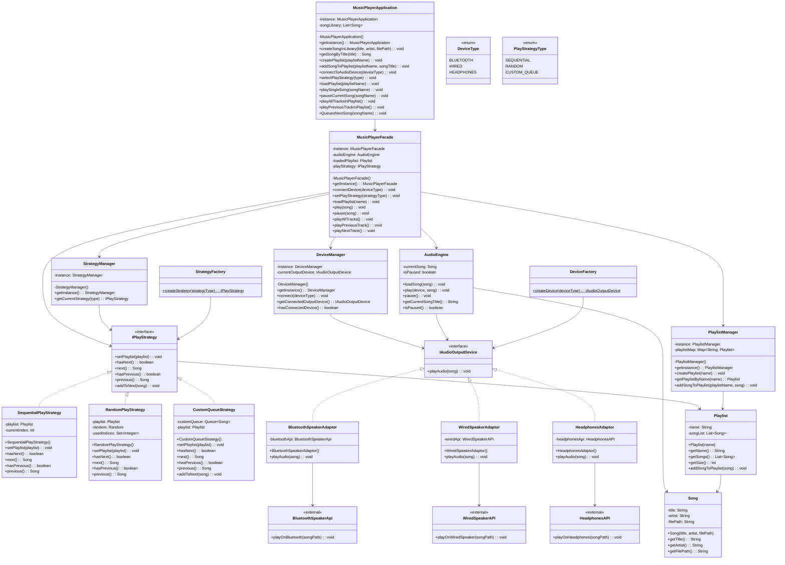
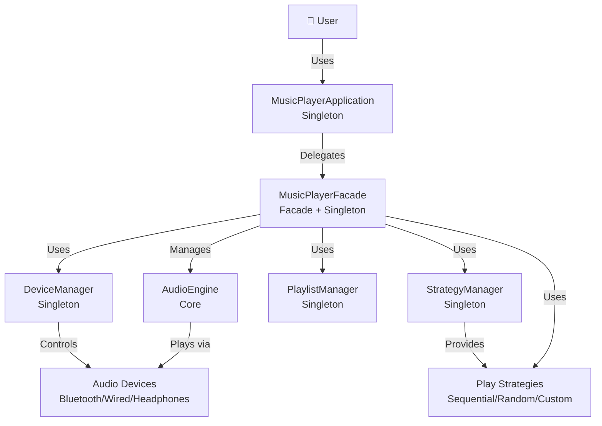
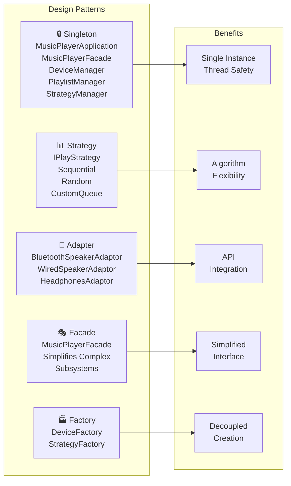
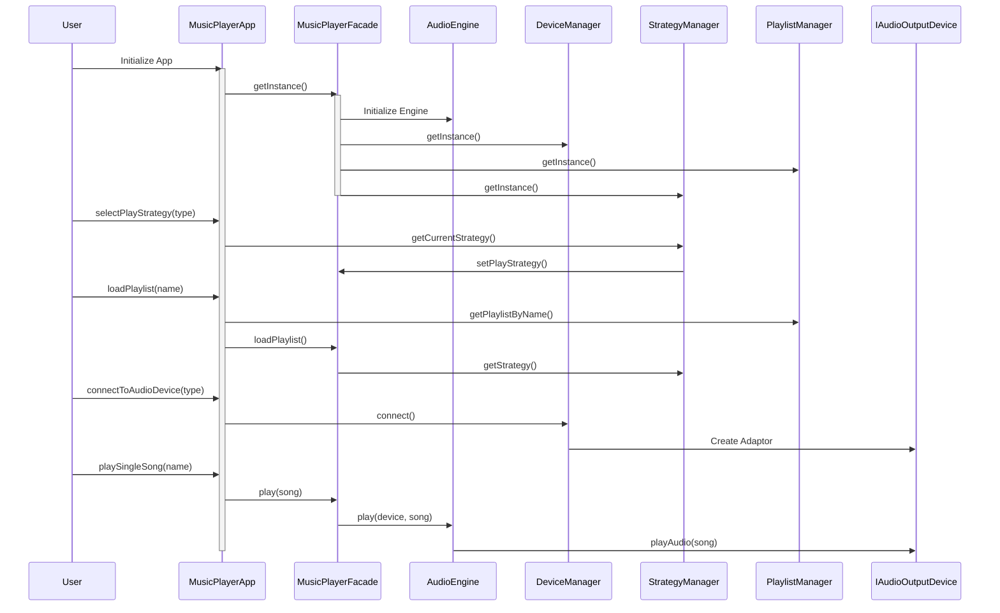

# Music Player System - UML Class Diagram

## Complete UML Class Diagram



## Simplified Component Diagram



## Pattern Application Diagram



## Interaction Flow Diagram



## Class Hierarchy

### Strategy Hierarchy
```
IPlayStrategy (Interface)
├── SequentialPlayStrategy
├── RandomPlayStrategy
└── CustomQueueStrategy
```

### Device Hierarchy
```
IAudioOutputDevice (Interface)
├── BluetoothSpeakerAdaptor
├── WiredSpeakerAdaptor
└── HeadphonesAdaptor
```

### Manager Hierarchy (All Singleton)
```
Manager (Abstract Concept)
├── DeviceManager
├── PlaylistManager
└── StrategyManager
```

## Dependency Graph

### Core Dependencies
```
MusicPlayerApplication
├── MusicPlayerFacade
│   ├── AudioEngine
│   ├── DeviceManager
│   ├── PlaylistManager
│   └── StrategyManager
└── PlaylistManager
    └── Playlist
        └── Song

DeviceManager
└── IAudioOutputDevice
    ├── BluetoothSpeakerAdaptor
    ├── WiredSpeakerAdaptor
    └── HeadphonesAdaptor

StrategyManager
└── IPlayStrategy
    ├── SequentialPlayStrategy
    ├── RandomPlayStrategy
    └── CustomQueueStrategy
```

## Object Creation Sequence

### Application Startup
```
1. MusicPlayerApplication.getInstance()
2.   ↓ Creates
3. MusicPlayerFacade
4.   ├─ Creates AudioEngine
5.   └─ Gets Manager Singletons
6.       ├─ DeviceManager.getInstance()
7.       ├─ PlaylistManager.getInstance()
8.       └─ StrategyManager.getInstance()
```

### Playback Initialization
```
1. selectPlayStrategy(SEQUENTIAL)
2.   ↓ Delegates to
3. StrategyManager.getCurrentStrategy()
4.   ↓ Creates
5. SequentialPlayStrategy
6.   ↓ Set in
7. MusicPlayerFacade

8. loadPlaylist("Playlist Name")
9.   ↓ Delegates to
10. PlaylistManager.getPlaylistByName()
11.   ↓ Gets
12. Playlist with Songs
13.   ↓ Strategy loads
14. Songs List
```

### Device Connection
```
1. connectToAudioDevice(BLUETOOTH)
2.   ↓ Delegates to
3. DeviceManager.connect()
4.   ↓ Calls
5. DeviceFactory.createDevice()
6.   ↓ Creates
7. BluetoothSpeakerAdaptor
8.   ↓ Wraps
9. BluetoothSpeakerApi
```
