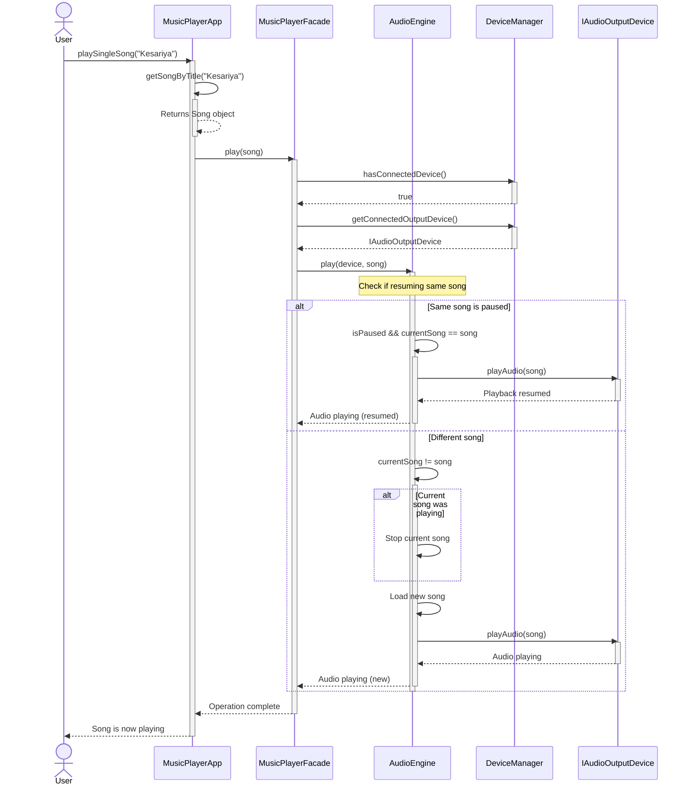
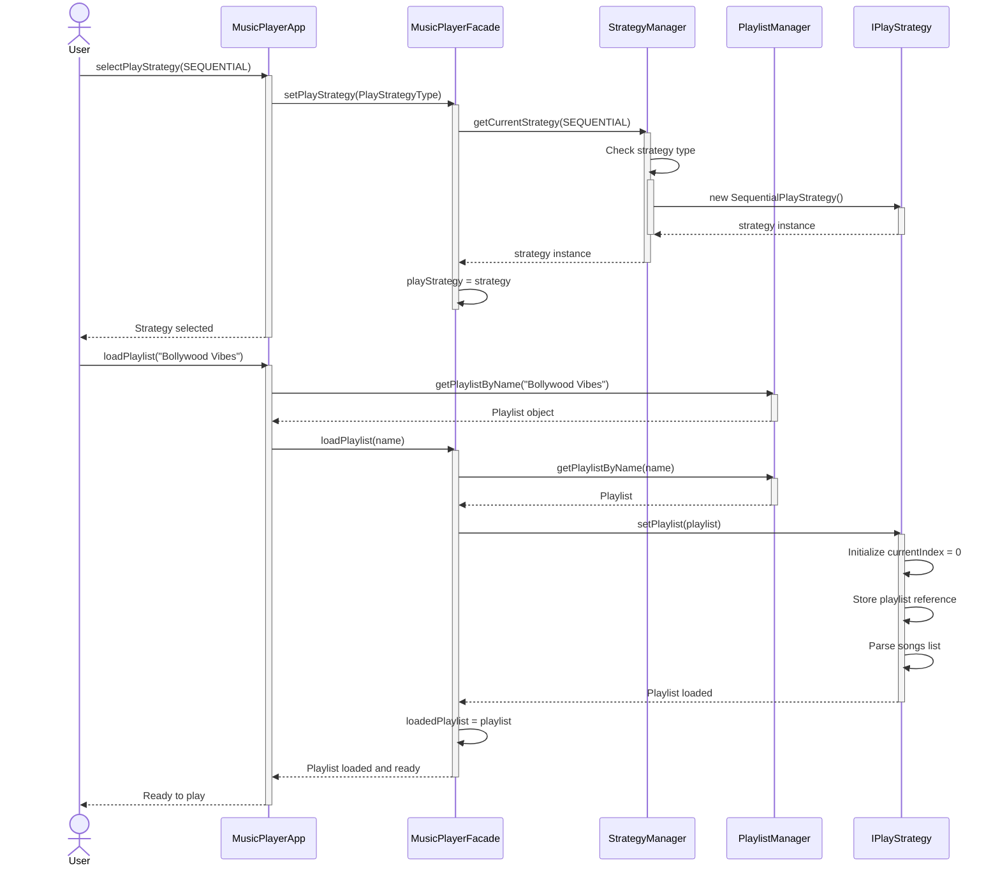
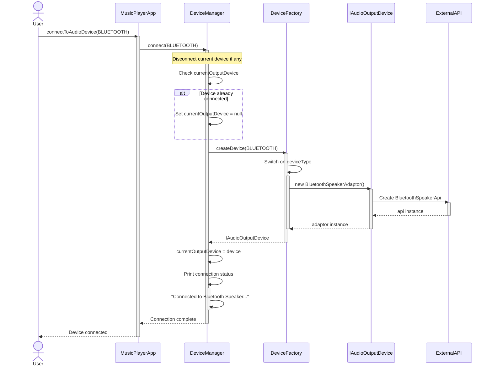
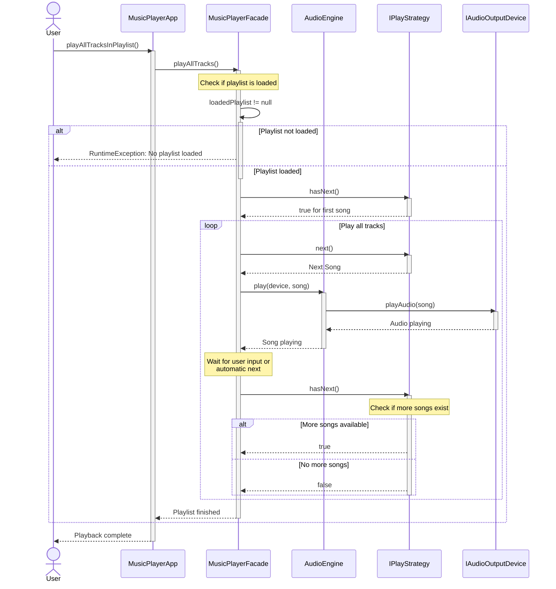
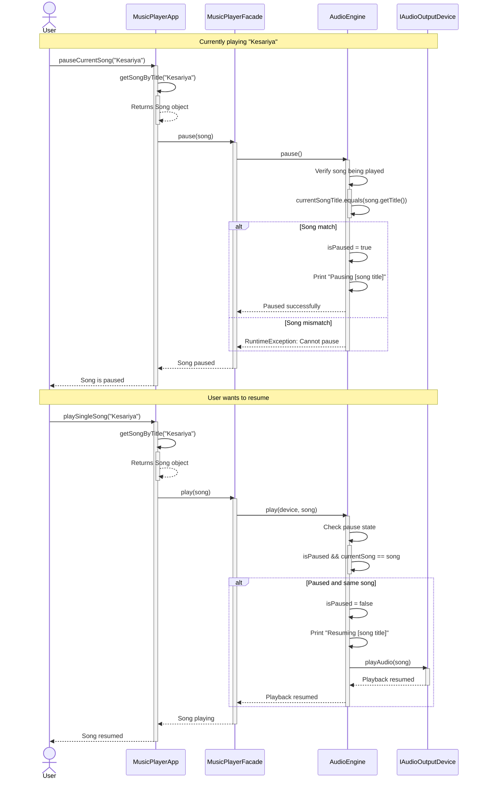
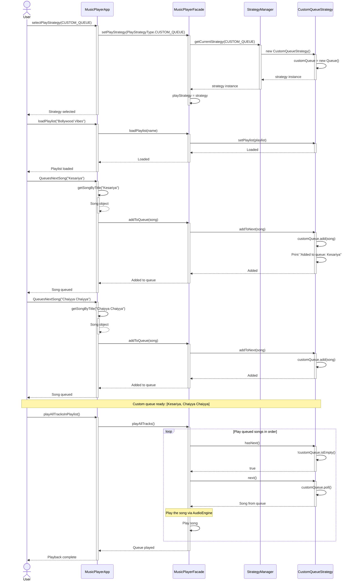
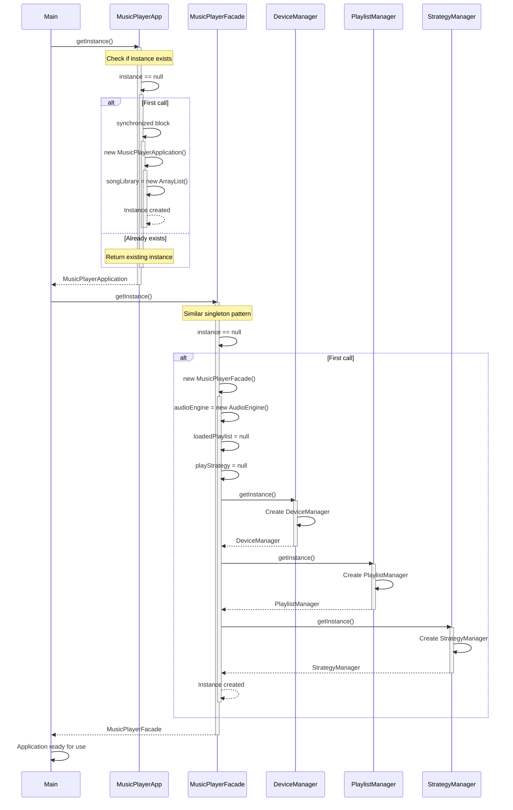

# Sequence Diagrams - Music Player System

## 1. Playing a Single Song Sequence

## 2. Loading Playlist with Strategy Sequence

## 3. Device Connection Sequence

## 4. Playing All Tracks from Playlist Sequence

## 5. Pause and Resume Sequence

## 6. Custom Queue Strategy Sequence

## 7. Complete Application Initialization Sequence

---

## Summary of Key Interactions

### 1. Playback Flow
1. User selects strategy
2. Facade gets strategy from StrategyManager
3. User loads playlist
4. Strategy initializes with playlist songs
5. User initiates playback
6. AudioEngine communicates with device
7. Output device plays the audio

### 2. Device Management Flow
1. User requests device connection
2. DeviceManager uses Factory to create adapter
3. Adapter wraps external API
4. DeviceManager stores reference
5. AudioEngine uses device for playback

### 3. Strategy Selection Flow
1. User selects strategy type
2. StrategyManager creates appropriate strategy
3. Facade stores strategy
4. Strategy is ready for playlist operations

### 4. Error Handling Patterns
- Check device connection before playback
- Verify playlist is loaded
- Validate song exists in library
- Confirm pause target matches current song
- Handle invalid strategy types

---

## Important Notes

1. **Thread Safety**: All Singletons use synchronized blocks in getInstance()
2. **Resource Management**: Device switching properly sets old device reference to null
3. **Strategy Pattern**: Strategies can be swapped at runtime
4. **Adapter Pattern**: External APIs are wrapped, not directly used
5. **Facade Pattern**: All complexity hidden behind MusicPlayerFacade
